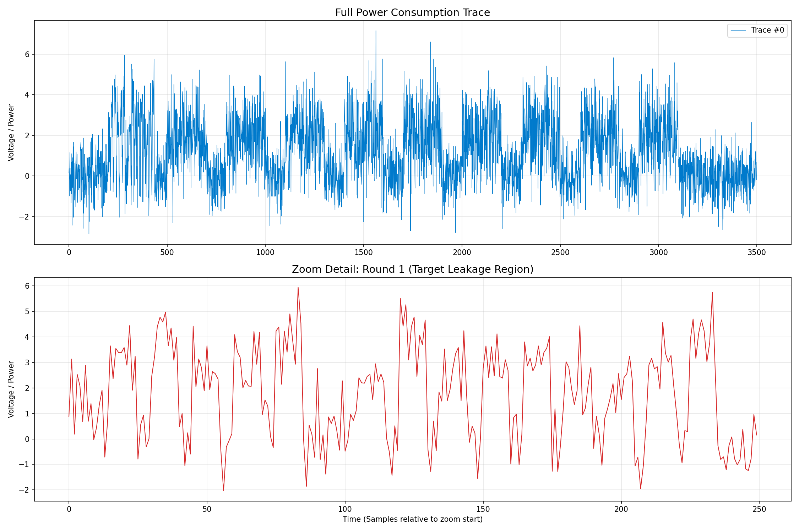

{\rtf1\ansi\ansicpg1252\cocoartf2822
\cocoatextscaling0\cocoaplatform0{\fonttbl\f0\fswiss\fcharset0 Helvetica;}
{\colortbl;\red255\green255\blue255;}
{\*\expandedcolortbl;;}
\paperw11900\paperh16840\margl1440\margr1440\vieww11520\viewh8400\viewkind0
\pard\tx720\tx1440\tx2160\tx2880\tx3600\tx4320\tx5040\tx5760\tx6480\tx7200\tx7920\tx8640\pardirnatural\partightenfactor0

\f0\fs24 \cf0 # \uc0\u55357 \u56693 \u65039  The Silent Whisper: AES Side-Channel Attack Challenge\
\
> **Category:** Cryptography / Side-Channel Analysis (SCA)  \
> **Difficulty:** Intermediate  \
> **Target:** AES-128 Encryption  \
\
## \uc0\u55357 \u56540  Scenario\
We have intercepted a series of power consumption traces from an embedded secure device while it was performing AES-128 encryption operations. We know the device is leaking information through its power consumption (Correlation Power Analysis or Deep Learning vulnerability).\
\
We also managed to capture the **plaintext** associated with each encryption, but the **Secret Key** remains unknown.\
\
**Your Mission:** Analyze the power traces, correlate them with the plaintexts, and extract the 16-byte Secret Key.\
\
---\
\
## \uc0\u55357 \u56514  Repository Contents\
* **`aes_challenge_public.npz`**: The main dataset file containing traces and plaintexts.\
* **`trace_combined_view.png`**: A visualization of the captured power traces for reference.\
\
## \uc0\u55357 \u56522  Dataset Specifications\
The provided `.npz` file is a NumPy archive containing two main arrays:\
\
1.  **`traces`**:\
    * **Shape:** `(1000, 3500)`\
    * **Description:** 1000 captured traces. Each trace consists of 3500 floating-point samples representing voltage/power consumption over time. The signal contains simulated noise and covers 10 rounds of AES.\
2.  **`plaintext`**:\
    * **Shape:** `(1000, 16)`\
    * **Description:** The 16-byte input message (integer values 0-255) corresponding to each trace.\
\
\
*Figure 1: Visualization of the captured power trace (Top) and a zoom-in on the first round leakage (Bottom).*\
\
---\
\
## \uc0\u55357 \u57056 \u65039  How to Start (Python)\
\
You can load the data using Python and NumPy. Here is a starter snippet:\
\
```python\
import numpy as np\
import matplotlib.pyplot as plt\
\
# 1. Load the dataset\
data = np.load('aes_challenge_public.npz')\
traces = data['traces']\
plaintexts = data['plaintext']\
\
print(f"Trace shape: \{traces.shape\}")      # Should be (1000, 3500)\
print(f"Plaintext shape: \{plaintexts.shape\}")  # Should be (1000, 16)\
\
# 2. Visualize the first trace\
plt.plot(traces[0])\
plt.title("Trace #0")\
plt.show()\
\
# 3. TODO: Implement CPA or Deep Learning attack to recover the Key}